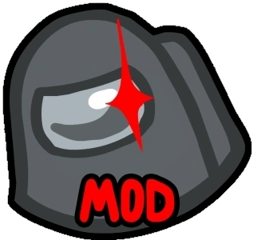

# AUMods-List

A large list of Among Us mods

> ⚠️ Warning
> 
> This list is not affiliated with, endorsed by, or sponsored by Innersloth LLC or Among Us. The mods listed here are also not affiliated with, endorsed by, or sponsored by Innersloth LLC.

# QoL Mods

| Mod name | Description | GitHub | Starlight? |
| ----- | ----- | ------- | ------- |
| AUnlocker | Unlocks all Among Us features: cosmetics, account, chat... and offers other QoL features such as FPS unlocking. | [GitHub](https://github.com/astra1dev/AUnlocker) | Yes |
| BetterAmongUs | QoL mod that adds an AntiCheat (host & non-host) and other cool features | [GitHub](https://github.com/D1GQ/BetterAmongUs) | Yes |
| Stereo | Adds custom lobby music | [GitHub](https://github.com/DaemonBeast/Stereo) | No |

# Modding APIs

| Mod name | Description | GitHub | Starlight? |
| ----- | ----- | ----- | ----- |
| Reactor | Reactor is a modding API used by a lot of mods. It makes mod development easier. | [GitHub](https://github.com/NuclearPowered/Reactor), [Documentation](https://docs.reactor.gg), [NuGet](https://www.nuget.org/packages/Reactor) | Yes |
| MiraAPI | An Among Us modding API that can create buttons, roles,  modifiers... (requires Reactor) | [GitHub](https://github.com/All-Of-Us-Mods/MiraAPI/), [NuGet](https://nuget.org/packages/AllOfUs.MiraAPI) | Yes |
| FungleAPI | Inspired by both Reactor & MiraAPI, this modding API can add buttons, lobby options, roles, cosmetics & more. | [GitHub](https://github.com/OBit508/FungleAPI) | Yes |

# Host-only Mods

| Mod name | Description | GitHub | Starlight? |
| ----- | ----- | ----- | ----- |
| AmongUsRevamped | AmongUsRevamped is a Host-only mod that adds custom gamemodes, an AntiCheat, and some QoL features. It does not use the Modded Protocol, which means you can create public lobbies with it! | [GitHub](https://github.com/ApeMV/AmongUsRevamped) | No |
| Endless Host Roles (EHR) | EHR is the biggest Host-only mod that adds 500+ custom roles, alllows 15+ player lobbies, and 7 custom gamemodes. | [GitHub](https://github.com/Gurge44/EndlessHostRoles) | Yes |
| Town of Host Optimized |  | [GitHub](https://github.com/Limeau/TownofHost-Optimized) | Yes |
| Project Lotus | LotusContinued is a Host-only mod for Among Us that adds custom cosmetics, unique roles & more! | [GitHub](https://github.com/Lotus-AU/LotusContinued) | Yes |
| Town of Next |  | [GitHub](https://github.com/TownOfNext/TownOfNext) | Yes |

# Custom Servers

> 🟢 Impostor
>
> Impostor is an Open Source Among Us private server reimplentation, written in C#. You can selfhost it on your PC, a Raspberry Pi, or any VPS.
>
> The servers listed below either use regular Impostor (open source) or modded/custom Impostor (closed source most of the time)
>
> Regular Impostor: https://github.com/Impostor/Impostor

| Server name | Impostor | Website |
| ----- | ----- | ----- |
| Skeld.net | Modded Impostor (Closed Source) | [Website](https://skeld.net) |
| Niko Servers (EU, NA, AS, CN2) | Modded Impostor (Closed Source) | [Website](https://au.niko233.top) |
| Modded NA/EU/AS | Regular Impostor (Open Source) | [Website](https://duikbo.at) |
| ModdedCrew (EU) | [Empostor](https://github.com/Empostor/Empostor) (Open Source) | [Website](https://website.moddedcrew.duckdns.org) |
| All Of Us (EU) | Modded Impostor (Closed Source) | [Website](https://allofus.dev) |
| MAUL (NA, EU) | ??? | [Website](https://moddedamong.us) |
| Jarne (EU) | ??? | None |

Mods to add custom regions:

| Mod name | Description | GitHub |
| ----- | ----- | ----- |
| Mini.RegionInstall | Mini.RegionInstall is a BepInEx plugin that adds modded regions to Among Us. Used by some mods | [GitHub](https://github.com/miniduikboot/Mini.RegionInstall) |
| RegionInstaller | RegionInstaller is a BepInEx plugin that adds custom & modded regions to Among Us through a config file. | [GitHub](https://github.com/Nb1X/RegionInstaller) |

# Custom Maps

| Mod name | Description | GitHub | Starlight? |
| ----- | ----- | ----- | ----- |
| Submerged | Submerged is a custom underwater themes custom app with 2 floors, custom vents, unique tasks & custom sabotages. | [GitHub](https://github.com/SubmergedAmongUs/Submerged) | Coming soon! |
| LevelImposter | LevelImposter is a mod that allows you to create your own custom maps, and play on community-made maps on the marketplace. | [GitHub](https://github.com/DigiWorm0/LevelImposter) | Yes |
| BetterPolus | BetterPolus is a mod that tweaks Polus, making it better and organized | [GitHub](https://github.com/Brybry16/BetterPolus) | No |

# Other

| Mod name | Description | GitHub | Starlight? |
| ----- | ----- | ----- | ----- |
| AleLuduMod | AleLuduMod allows you to create 15+ players lobbies and changes the meeting UI, shapeshift menu & vitals to fit 35 players. | [GitHub](https://github.com/townofus-pl/AleLuduMod) | Yes |
| Overloaded | Overloaded is another mod that allows you to create 15+ player lobbies and up to 127 players. Useful for Hide N Seek. | [GitHub](https://github.com/All-Of-Us-Mods/Overloaded) | Yes |
